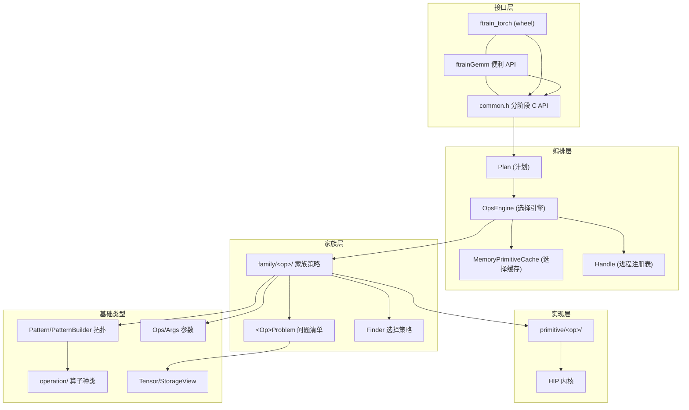
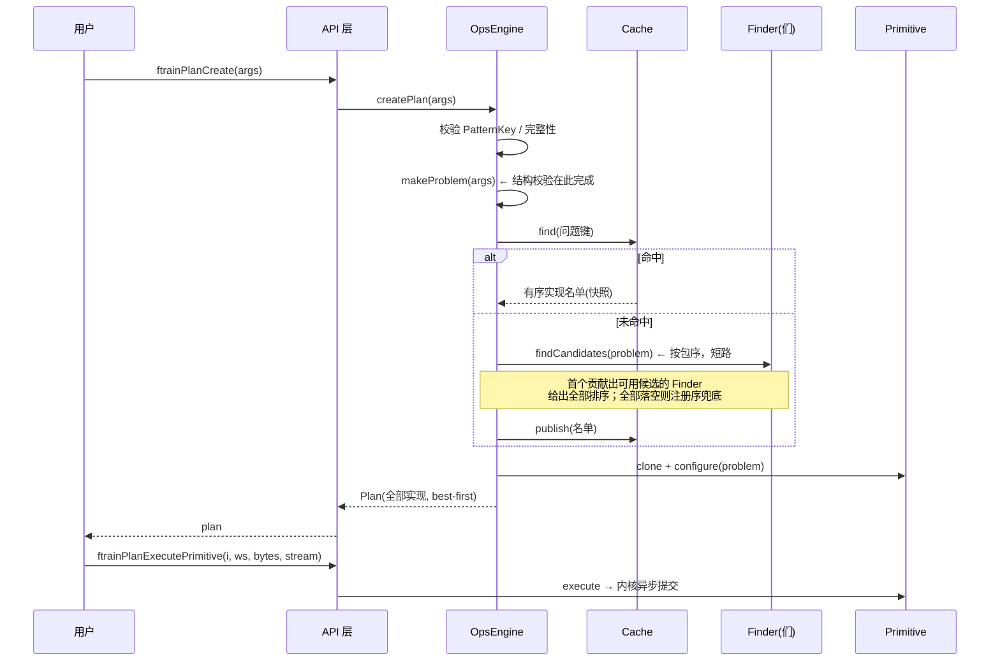

# flash-train 架构

flash-train 是面向 Hygon DCU（HIP/gfx938）的训练算子库：用户描述**要算什么**（Pattern/Args），库负责**选哪个实现**（引擎 + 选择机制）并**异步执行**（Primitive + 内核）。三个关注点各自成层。

## 1. 分层总览



依赖方向自上而下单向；家族层不知道引擎的存在，实现层不知道选择机制的存在。

## 2. 各层职责

| 层 | 模块 | 职责 | 关键设计 |
|---|---|---|---|
| 接口 | `api/`、`python/` | C ABI、异常→状态码转换、pybind 绑定 | 三入口共用一条路径，便利 API 只是替用户写样板 |
| 编排 | `Plan` | 持有已配置 Primitive 列表，按下标执行 | 创建即保证 ≥1 可用；下标 0 为推荐默认 |
| 编排 | `OpsEngine` | 校验参数、查缓存、跑选择、发布结果 | CRTP 策略装配（编译期家族/查找器组合）；常量对象，唯一可变态是缓存 |
| 编排 | `MemoryPrimitiveCache` | 问题→有序实现名单的备忘录 | 有界（LFU 逐出）、读写锁、快照读零拷贝 |
| 编排 | `Handle` | PatternKey→引擎的进程级注册表 | 注册一次、不可替换、多线程安全 |
| 家族 | `family/<op>/` | 一个算子家族的全部资料 | Problem 清单（校验构造器 + `getProblemKey`）；Roles 束绑（端口 ID 与 Pattern 同源） |
| 实现 | `primitive/<op>/` | `isApplicable`/`configure`/`executeImpl` | clone 进 Plan 后与源 Args 解耦；标量按值入内核 |
| 基础 | `operation/`、`pattern.hpp` 等 | 算子种类、拓扑、参数容器 | 结构同构匹配，忽略加入顺序 |

## 3. 一次调用的生命周期



便利入口（`ftrainGemm`/`ftrain_torch.gemm`）在内部走同一序列，只是把一次性件（Ops、端口 ID）缓存为进程级静态，每次调用重建 Args 与 Plan。

## 4. 选择机制

- **判定分工**：结构合法性归 `Problem` 校验构造器；`isApplicable` 只回答值支持问题；workspace 预算归调用方（遍历 `GetPrimitiveRequiredWorkspaceBytes`）。
- **排序规则**：Finder 候选（偏好序）在前；全部 Finder 无贡献时，全部适用记录按注册序兜底；Finder 返回的名字匹配不到记录时跳过。
- **缓存正确性**：键 = 约束 token + 问题 token（各自类型负责编码自己的字段）；命中跳过 Finder 与 isApplicable，故键必须覆盖一切能改变选择的属性。缓存有界，满员按命中次数最低逐出。

## 5. 并发与生命周期模型

- 引擎是进程内每家族一个的单例；除缓存外不可变，天然支持并发 `createPrimitives`（缓存自带读写锁，计数为原子量）。
- Plan 独立于源 Ops/Args 存活；Tensor 内存不托管。
- 执行异步：内核提交后，`Primitive`、引用内存、workspace 须保持有效直至所在流完成。

## 6. 目录导览

```
src/include/flash_train/
    engine.hpp / primitive.hpp      两个机制层接口
    cache / plan / constraints /    编排层基础件
    handle / api / error / trace
    family/<op>/                    家族资料：problem + finder + family
    primitive/<op>/                 内核实现
    operation/                      算子种类（Traits/属性）
src/                                与上同构：api/ family/ primitive/ + 各机制 .cpp
python/                             ftrain_torch 绑定（双 TU 隔离 torch/HIP 头）
include/flash_train/                公共 C API：common.h（分阶段）、flash_train.h（便利）、env.h
tests/                              与 src 目录镜像；python/ 为绑定数值对拍
docs/                               本文档
```

## 7. 扩展点

| 想扩展什么 | 触碰点 | 详见 |
|---|---|---|
| 新算子家族 | operation 层 → family/<op>/ → primitive/<op>/ → `engine.cpp` 一行 | `development.md` §1 |
| 现有家族加实现 | 实现文件 + 家族 `makeRecords()` | `development.md` §2 |
| 新选择启发式 | 家族目录下新 Finder，加进引擎模板包 | `engine.hpp` 契约注释 |
