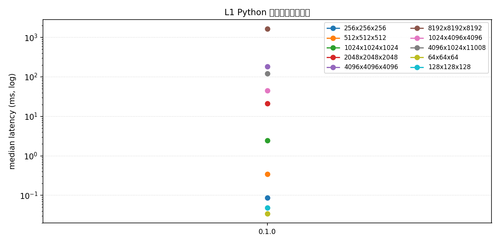
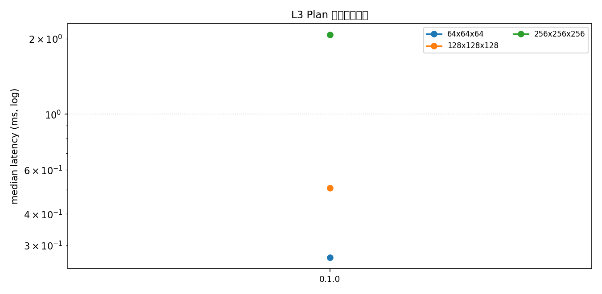
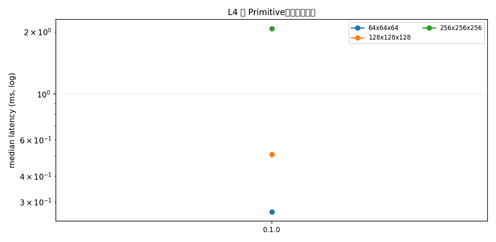

# gemm 性能曲线（fp32）

> 最近环境：BW1102（unknown） · torch 2.7.1 · ftrain-torch 0.1.0 · 2026-09-22；聚合全部历史结果（`benchmarks/results/`）自动生成。

> 当前仅一个版本（0.1.0）的数据——曲线将随版本发布自动延长。

## L1 Python 便利层（端到端）

| 形状 (m×k×n) | 0.1.0 |
|---|---|
| 64x64x64 | 0.034 |
| 128x128x128 | 0.049 |
| 256x256x256 | 0.087 |
| 512x512x512 | 0.345 |
| 1024x1024x1024 | 2.460 |
| 2048x2048x2048 | 21.084 |
| 1024x4096x4096 | 45.200 |
| 4096x1024x11008 | 122.401 |
| 4096x4096x4096 | 182.931 |
| 8192x8192x8192 | 1653.196 |

## L2 C 便利层（端到端）

| 形状 (m×k×n) | 0.1.0 |
|---|---|
| 64x64x64 | 0.285 |
| 128x128x128 | 0.525 |
| 256x256x256 | 2.091 |

## L3 Plan 复用（稳态）

| 形状 (m×k×n) | 0.1.0 |
|---|---|
| 64x64x64 | 0.268 |
| 128x128x128 | 0.509 |
| 256x256x256 | 2.075 |

## L4 逐 Primitive（实现矩阵）

| 形状 (m×k×n) | 0.1.0 |
|---|---|
| 64x64x64 | 0.268 |
| 128x128x128 | 0.509 |
| 256x256x256 | 2.074 |

数据来源：`benchmarks/results/`；口径与公平性规则见 [benchmarks/README.md](../../benchmarks/README.md)。
