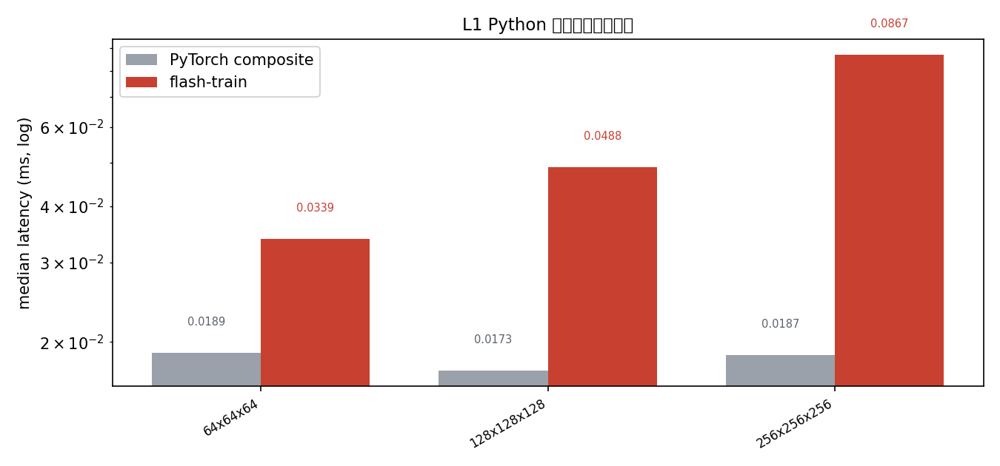
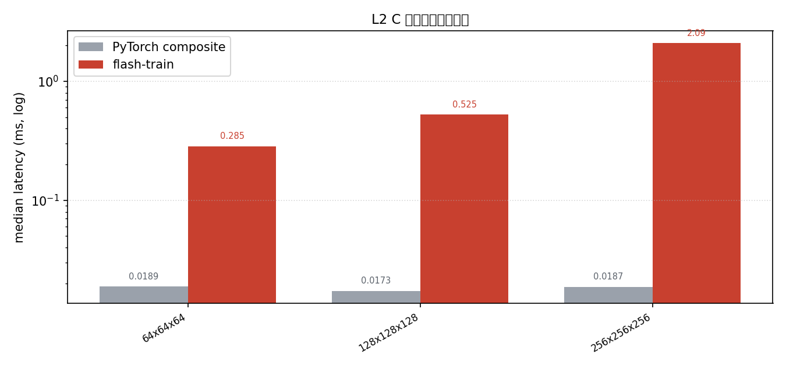
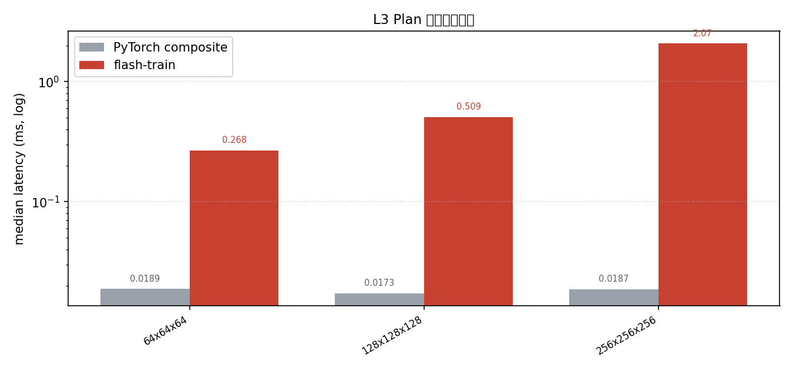

# gemm 基准（fp32）

> 条件：BW1102（unknown） · torch 2.7.1 · ftrain-torch 0.1.0 · 2026-09-22
> 口径：事件计时中位数；基线为 PyTorch 组合实现；计时策略与公平性规则见 [benchmarks/README.md](../../benchmarks/README.md)

## L1 Python 便利层（端到端）

| 形状 (m×k×n) | 基线 ms | flash-train ms | 加速比 |
|---|---:|---:|---:|
| 64x64x64 | 0.019 | 0.034 | x0.56 |
| 128x128x128 | 0.017 | 0.049 | x0.35 |
| 256x256x256 | 0.019 | 0.087 | x0.22 |

## L2 C 便利层（端到端）

| 形状 (m×k×n) | 基线 ms | flash-train ms | 加速比 |
|---|---:|---:|---:|
| 64x64x64 | 0.019 | 0.285 | x0.07 |
| 128x128x128 | 0.017 | 0.525 | x0.03 |
| 256x256x256 | 0.019 | 2.091 | x0.01 |

## L3 Plan 复用（稳态）

| 形状 (m×k×n) | 基线 ms | flash-train ms | 加速比 |
|---|---:|---:|---:|
| 64x64x64 | 0.019 | 0.268 | x0.07 |
| 128x128x128 | 0.017 | 0.509 | x0.03 |
| 256x256x256 | 0.019 | 2.075 | x0.01 |

## L4 逐 Primitive（实现矩阵）

| 形状 (m×k×n) | # | 实现 | 中位数 ms | workspace |
|---|---:|---|---:|---:|
| 64x64x64 | 0 | Fp32Gemm | 0.268 | 0 B |
| 128x128x128 | 0 | Fp32Gemm | 0.509 | 0 B |
| 256x256x256 | 0 | Fp32Gemm | 2.074 | 0 B |

数据来源：`benchmarks/results/`（随版本提交；复现步骤见 [benchmarks/README.md](../../benchmarks/README.md)）。
