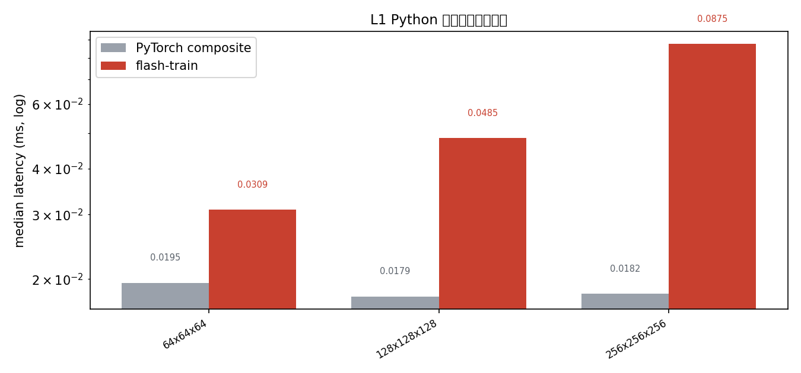
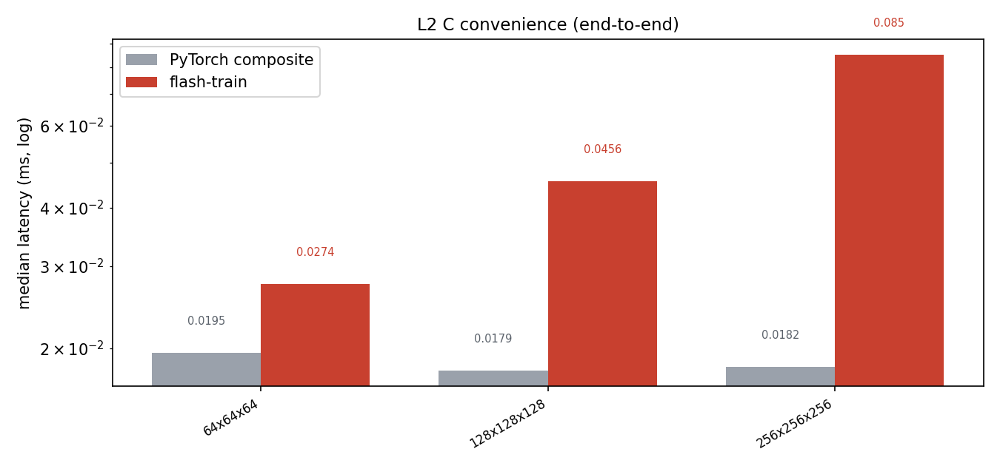
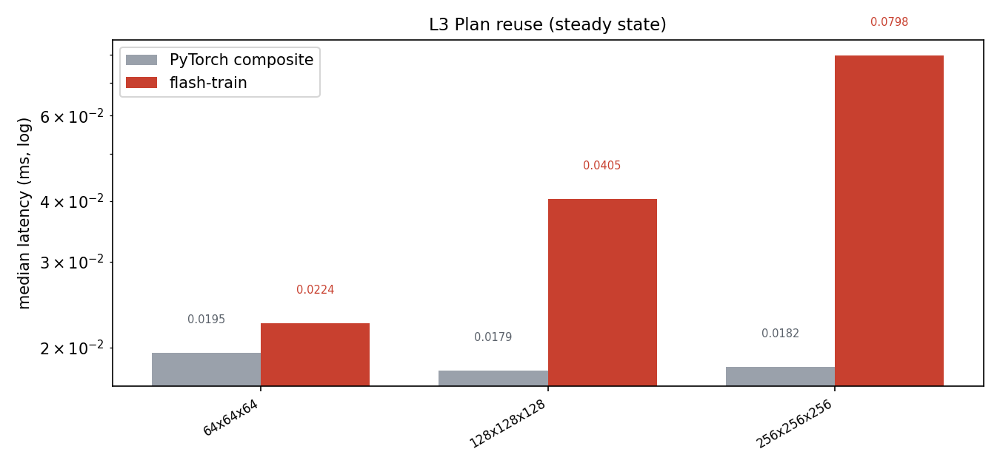

# gemm 基准（fp32）

> 条件：BW1102（unknown） · torch 2.7.1 · flash-train 0.1.0 · 2026-09-29
> 口径：事件计时中位数；基线为 PyTorch 组合实现；计时策略与公平性规则见 [benchmarks/README.md](../../benchmarks/README.md)

## L1 Python 便利层（端到端）

| 形状 (m×k×n) | 基线 ms | flash-train ms | 加速比 |
|---|---:|---:|---:|
| 64x64x64 | 0.020 | 0.031 | x0.63 |
| 128x128x128 | 0.018 | 0.048 | x0.37 |
| 256x256x256 | 0.018 | 0.088 | x0.21 |

## L2 C 便利层（端到端）

| 形状 (m×k×n) | 基线 ms | flash-train ms | 加速比 |
|---|---:|---:|---:|
| 64x64x64 | 0.020 | 0.027 | x0.71 |
| 128x128x128 | 0.018 | 0.046 | x0.39 |
| 256x256x256 | 0.018 | 0.085 | x0.21 |

## L3 Plan 复用（稳态）

| 形状 (m×k×n) | 基线 ms | flash-train ms | 加速比 |
|---|---:|---:|---:|
| 64x64x64 | 0.020 | 0.022 | x0.87 |
| 128x128x128 | 0.018 | 0.040 | x0.44 |
| 256x256x256 | 0.018 | 0.080 | x0.23 |

## L4 逐 Primitive（实现矩阵）

| 形状 (m×k×n) | # | 实现 | 中位数 ms | workspace |
|---|---:|---|---:|---:|
| 64x64x64 | 0 | Fp32Gemm | 0.022 | 0 B |
| 128x128x128 | 0 | Fp32Gemm | 0.040 | 0 B |
| 256x256x256 | 0 | Fp32Gemm | 0.080 | 0 B |

数据来源：`benchmarks/results/`（随版本提交；复现步骤见 [benchmarks/README.md](../../benchmarks/README.md)）。
